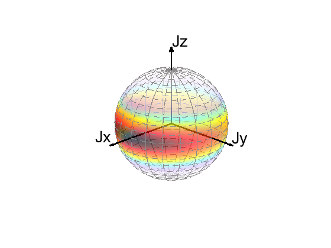
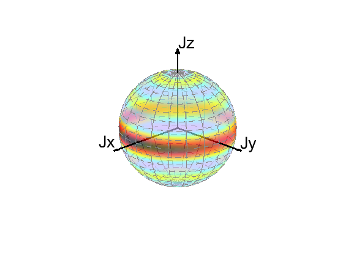
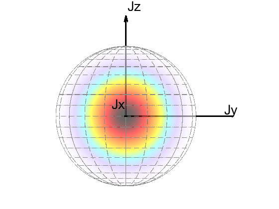
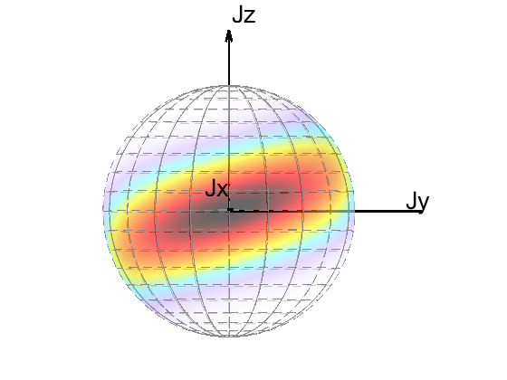

# Introduction

MATLAB codes for calculating the evolution of quantum states under collective spin, including the drawing of Bloch's sphere.


## Structure of the repositories
The src (source code) folder provides basic codes including following three files
* example.mlx : examples of drawing states
* J_operator.m: Basic operator of collective spin operators $J_x,J_y,J_z$
* CollectiveSpin.m: Class of using collective spin operators, such as quantum states including the spin coherent states, spin squeezed states, spin cat states..., Hamilton of one-axis twisting (OAT), twist and turn (TNT)...
* Bloch.m:      Drawing the quantum states (pure state/mixed state) and operators with Husimi-Q or Wigner distribution on Bloch sphere.
* HusimiQ_spin.m: Husimi-Q distribution
* Wigner_spin.m: Wigner distribution
* Wigner3j.m: Compute the Wigner 3j symbol using the Racah formula, by Kobi (https://www.mathworks.com/matlabcentral/fileexchange/20619-wigner3j-symbol). 
* harmonicY.m: Compute the Spherical harmonic function, by Javier Montalt Tordera (https://github.com/jmontalt/harmonicY/releases/tag/v2.0.1)


## Examples of drawing states 

### an arbitrary input state vector or density matrix
% Example1: For 

```matlab
% Example1: For an arbitrary input state vector or density matrix

state = [[1.10635674e-10]
 [5.69368449e-08]
 [1.39820063e-05]
 [1.67372366e-03]
 [8.25903465e-02]
 [9.93152590e-01]
 [8.25903465e-02]
 [1.67372366e-03]
 [1.39820063e-05]
 [5.69368449e-08]
 [1.10635674e-10]];

[Q,figQ] = bloch(state);
[W,figW] = bloch(state,"Wigner");

% [dis, h] = bloch(state, distribution, views)
% distribution: "Husimi"(default)  or "Wigner"
% views: "X", "Y", "Z",  plot the 3D perspective when no input
```

<table>
    <tr>
        <td><center> Husimi-Q distribution of an arbitrary input state </center> </td>
        <td><center> Wigner distribution of an arbitrary input state </center> </td>
    </tr>
</table>

### coherent state 
```matlab
% Example2: spin coherent state 

N = 10;
sys = CollectiveSpin(N);
theta_SCS = pi/2;
phi_SCS = 0;
SCS = sys.SCS(theta_SCS,phi_SCS);
[Q1,figQ1] = bloch(SCS,"Husimi");

```


### spin squeezed state 
```matlab
% Example3: spin squeezed state 

% chit = 24^(1/6)*(N/2)^(-2/3); 
chit = 0.5*24^(1/6)*(N/2)^(-2/3);
% SSS = sys.Rx(pi/2+sys.phi_OAT_opt(chit))*sys.OAT(chit,"z")*SCS; %
SSS = sys.SSS_opt(chit);

[Q2,figQ2] = bloch(SSS,"Husimi");

```


<table>
    <tr>
        <td><center> Husimi-Q distribution of SCS </center> </td>
        <td><center> Husimi-Q distribution of SSS </center> </td>
    </tr>
</table>