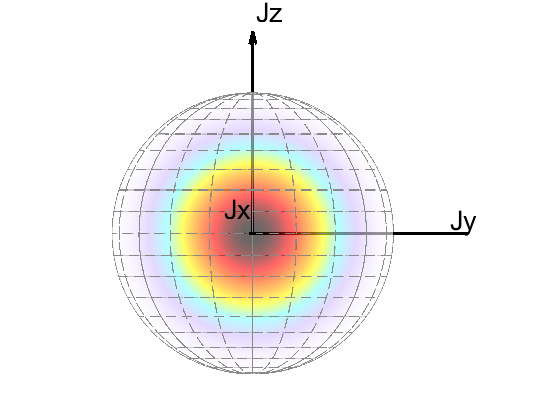
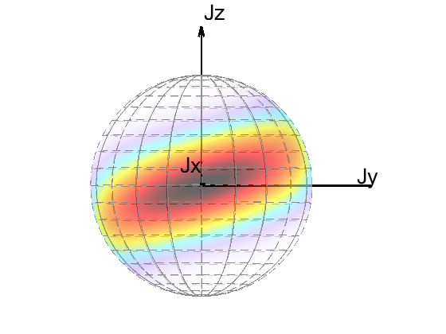

# Introduction

MATLAB codes for calculating the evolution of quantum states under collective spin, including the drawing of Bloch's sphere.


## Structure of the repositories
The src (source code) folder provides basic codes including following three files
* J_operator.m: Basic operator of collective spin operators $J_x,J_y,J_z$
* DickeTools.m: Class of using collective spin operators, such as quantum states including the spin coherent states, spin squeezed states, spin cat states..., Hamilton of one-axis twisting (OAT), twist and turn (TNT)...
* Bloch.m:      Drawing the Bloch sphere of quantum states (pure state/mixed state) with Huisimi-Q distribution

## Examples of drawing an coherent state and spin squeezed state 
```matlab
N = 10;
sys = DickeTools(N);
theta_SCS = pi/2;
phi_SCS = 0;
SCS = sys.SCS(theta_SCS,phi_SCS); % parameters denote the location of SCS on Bloch sphere
[Q,h] = bloch(SCS);
%[Q,h] = bloch(SCS,"x");
```

 


```matlab
chit = 0.1*pi;
U = sys.OAT(chit,"z");
SSS = U*SCS;
[Q1,h1] = bloch(SSS);
```matlab
 
